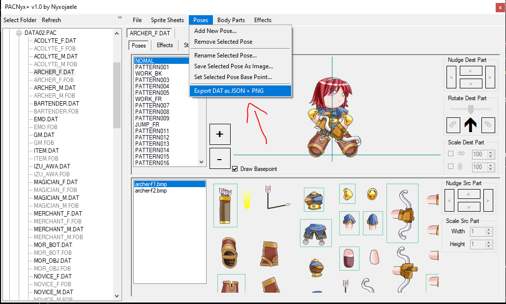
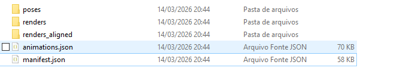
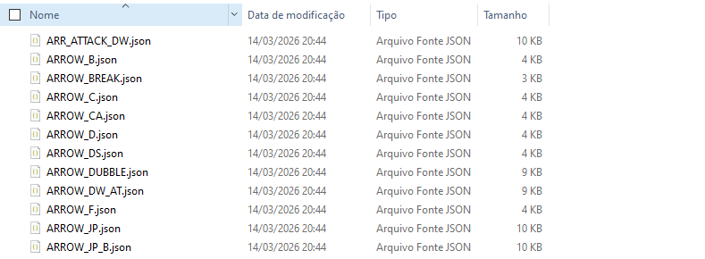
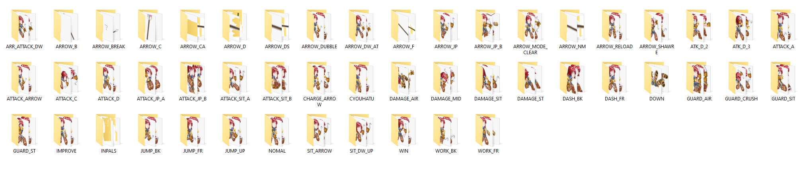
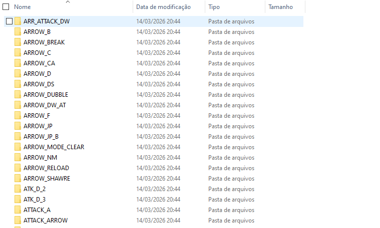
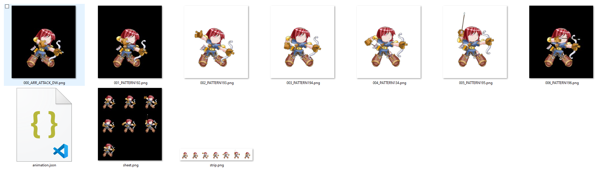

# RAGNAROK-BATTLE-OFFLINE-PACNYX-2026
PACNYX+ ULTRA VERSION FOR INDIE DEVS AND MOD COMMUNITY 
# PACNyx / PACNyx+

Classic archive and resource utility for **Ragnarok Battle Offline**.

This document describes a **2026 AI-assisted community patch workflow** for PACNyx+, with a focus on stability improvements, safer PAC rebuilding, practical quality-of-life fixes, and support for experimentation with new sprites, animations, and custom asset pipelines.

> **AI-assisted community update, 2026**

---

## Project intent

This updated build was patched independently with a simple goal:

**to help keep PACNyx from being left behind**, while making it more usable for people still interested in **Ragnarok Battle Offline modding**, preservation, and custom asset experimentation.

The work behind these adjustments was done to support the community and to make PACNyx+ more practical for modern use cases, including:

- testing custom DAT replacements in a safer way
- rebuilding PAC files with less manual friction
- experimenting with new sprite sheets and custom character visuals
- exploring the possibility of new animations and motion workflows inside RBO
- investigating whether some existing RBO bones, body part references, and sprite conventions could serve as a useful baseline for:
  - open source projects inspired by RBO
  - indie action games
  - small metroidvania prototypes
  - beginner-friendly animation pipelines based on pre-defined sprite/body structures

This is not presented as an official revival of PACNyx.  
It is a **practical attempt to keep the tool usable**, reduce avoidable crashes, and open room for creative experimentation.

---

## What is PACNyx?

PACNyx is a legacy utility used to inspect, extract, rebuild, and modify **RBO resource archives**, especially:

- `.PAC` archives
- internal `.DAT` resources
- image assets
- audio assets such as WAV

PACNyx+ expands the original workflow with more advanced editing features for DAT-based resources, including sprite sheets and related structures.

---

## Why these patches were made

PACNyx and PACNyx+ are valuable tools for anyone trying to understand or modify the asset structure of **Ragnarok Battle Offline**, but over time they became increasingly fragile in practical use.

This patched build exists to help with that.

The goals behind the current adjustments are:

- reduce crashes in real editing scenarios
- remove unnecessary friction from PAC rebuilding
- make file replacement more intuitive
- make experimentation with custom assets less painful
- preserve the usefulness of PACNyx+ for the RBO community
- encourage technical exploration of RBO-style animation structure for new community-driven or open projects

In other words, this work was done both as **maintenance** and as **creative infrastructure**.

---

## Features

- Open and inspect `.PAC` archives
- Extract all files from a `.PAC`
- Extract selected files from a `.PAC`
- View image resources stored inside RBO `.DAT` files
- Export internal DAT image resources as:
  - BMP
  - PNG
  - CG
  - IMG
- Listen to supported audio files such as WAV
- Create new `.PAC` archives
- Rebuild or resave `.PAC` archives
- Edit sprite sheet resources inside supported DAT editor views

---

## 2026 patched build improvements

This patched build focuses on **stability**, **quality-of-life improvements**, and **safer archive handling**.

### DAT editor fixes

- Fixed the **Change Selected SpriteSheet** bug caused by using only the file name instead of the full file path
- Added safer validation when replacing sprite sheets from disk
- Reduced crashes caused by invalid selection state in the DAT editor
- Improved null safety when removing sprite sheets
- Improved handling of pose and body part references when replacing or removing sprite sheets
- Improved sprite sheet preview redraw safety
- Improved DAT UI setup to avoid duplicated list entries and broken selection state
- Improved initialization of sprite sheet, pose, effect, and string UI lists

### PAC creation improvements

- Fixed crashes in **Create PAC** caused by recursive folder parsing on empty or invalid directories
- Improved safety when reading directories and subdirectories
- Improved safety when reading `.PAC` contents into the tree view
- Added support for selecting the **root PAC node** in the left tree and importing all internal entries at once
- Added automatic **replace-by-name** behavior in the output file list
- Selecting a modified file with the same name as an existing PAC entry now replaces the old one instead of being ignored
- Selecting a folder of modified files now works as a practical batch override workflow

### Safer base PAC handling

- Added support for loading a selected **base PAC** through a temporary copy in the Windows temp directory
- The original base PAC is now treated as a read source instead of the file actively manipulated by the tool
- Added cleanup logic for temporary PAC copies when the form is disposed
- Added protection against accidentally saving directly over the original base PAC
- Added validation to prevent creating an empty PAC with no selected files

### New DAT export pipeline

The current build now includes a much more powerful export workflow for DAT pose and animation analysis.

#### Pose export
- Added export of **all poses as structured JSON**
- Added export of **all poses as individual PNG files**
- Added filename normalization to remove embedded null characters and invalid DAT string artifacts
- Added sprite sheet name and sprite sheet index export per body part
- Added draw order export based on pose layer sorting

#### Animation grouping
- Added heuristic animation grouping based on pose naming order
- A non-`PATTERN` pose starts a new animation group
- Subsequent `PATTERN###` poses are grouped under the most recent named animation
- Added `animations.json` export for grouped frame sequences

#### Aligned render export
- Added grouped **aligned frame export** for animation reuse outside PACNyx
- Added `renders_aligned/` output with one folder per animation group
- Added fixed-canvas frame generation for each grouped animation
- Added origin-consistent alignment to reduce frame drift when pose width changes
- Added per-group automatic sizing to reduce clipping in wide or tall frames

#### Indie-friendly output formats
- Added per-animation `animation.json`
- Added `strip.png` export for horizontal frame strips
- Added `sheet.png` export for grid-based sprite sheets
- Added per-animation metadata including:
  - `frameWidth`
  - `frameHeight`
  - `anchorCanvasX`
  - `anchorCanvasY`
  - ordered frame list

---

## Recommended workflow

### Rebuild a PAC with one modified DAT

1. Open **Create PAC**
2. In the left tree, locate the original base `.PAC`
3. Select the **root PAC node**
4. Add all contents to the output list
5. Use **Select File** to add your modified `.DAT`
6. If the modified file has the same name as the original one, it will automatically replace it
7. Save the rebuilt PAC as a **new file**
8. Test the new PAC in-game

### Batch override workflow

1. Load the base PAC contents
2. Use **Select Directory**
3. Choose a folder containing multiple modified files
4. Matching file names will automatically replace original entries in the output list
5. Save as a new PAC
6. Test in-game

### DAT export workflow

1. Open a `.DAT` inside PACNyx+
2. Open the **Poses** menu
3. Use the DAT export option
4. Choose an output folder
5. Review the generated export structure:
   - `manifest.json`
   - `animations.json`
   - `poses/`
   - `renders/`
   - `renders_aligned/`

---














## Export output structure

A full DAT export may look like this:

```text
export/
  manifest.json
  animations.json
  poses/
    RUN_START.json
    PATTERN189.json
    JUMP_FR.json
  renders/
    RUN_START/
      000_RUN_START.png
      001_PATTERN189.png
    JUMP_FR/
      000_JUMP_FR.png
  renders_aligned/
    RUN_START/
      000_RUN_START.png
      001_PATTERN189.png
      animation.json
      strip.png
      sheet.png
    JUMP_FR/
      000_JUMP_FR.png
      animation.json
      strip.png
      sheet.png
Pose JSON export
Each pose is exported as a structured JSON file containing the parts used to build the final frame.

Typical fields include:

poseName

poseIndex

partCount

parts

Each part may include:

index

isEmpty

spriteSheetIndex

spriteSheetName

srcRect

destRect

origin

layer

drawOrder

rotation

xScale

yScale

flip

flipValue

color

This makes the export useful not only for visual inspection, but also for:

animation analysis

reverse engineering

custom rendering pipelines

tool building

documentation

Animation grouping logic
The build now uses a simple but practical grouping rule for pose sequences:

a pose name that does not start with PATTERN begins a new animation group

subsequent PATTERN### poses are treated as frames of the current group

a new non-PATTERN pose closes the previous group and starts the next one

This allows the export pipeline to derive grouped animations even when the original DAT stores them as a flat ordered pose list.

Aligned export logic
The aligned export is intended for reusable game-ready frame sequences, not just technical previews.

Why aligned export exists
Raw pose PNGs are useful for inspection, but they are not always ideal for real animation reuse because:

each frame may have a different bounding box

width and height vary per pose

visual mass may drift left or right

effects, weapons, or extended limbs may change the apparent center of the frame

How aligned export works
The aligned exporter:

analyzes the transformed bounds of all frames in an animation group

computes group-wide frame metrics

renders every frame into a shared fixed-size canvas

aligns the pose using a consistent origin-based placement strategy

This makes the output much more stable for:

sprite sheets

RPG Maker experiments

indie engines

prototype games

metroidvania tests

custom character generators

Per-animation metadata
Each aligned animation folder includes an animation.json file containing:

animation name

frame width

frame height

anchor X

anchor Y

ordered list of exported frame files

This metadata is intended to help future tooling, including:

custom runtime animation players

atlas builders

engine importers

web viewers

modding utilities

Sprite strip and sprite sheet export
Each aligned animation folder also includes:

strip.png

sheet.png

strip.png
A horizontal strip containing every frame in sequence.

Useful for:

quick previews

sprite strip importers

documentation

2D animation tools

sheet.png
A grid-based sheet containing every frame.

Useful for:

atlas-like inspection

manual slicing

engine import testing

sprite-based workflows

Experimental use cases
Beyond basic archive rebuilding, this patched workflow is also useful for exploring broader creative and technical possibilities.

Potential use cases include:

custom character visuals for RBO

testing alternative sprite sheets for existing characters

trying new animation concepts using the existing DAT structure

examining how body parts, references, and sprite segmentation behave in practice

exporting aligned frames for reuse in external engines

generating prototype sprite sheets for indie workflows

using RBO asset logic as a reference point for open source animation systems

studying whether RBO-style layered sprite workflows could inspire pipelines for:

indie action RPGs

side-scrollers

metroidvanias

small studio prototypes

educational or experimental 2D animation frameworks

This does not mean PACNyx+ is a full modern animation suite.
But it can now act as a much stronger technical bridge between preservation, reverse engineering, asset extraction, and creative reuse.

First launch
The first time PACNyx runs, it may ask for standard and expansion PAC files used by the game.

If you do not have some of them, skip those entries

Set the working folder to your RBO installation directory if needed

Safer usage notes
Always keep a backup of the original .PAC

Always keep a backup of the original .DAT

Prefer saving rebuilt PAC files under a new name first

Do not overwrite the base PAC directly unless you already have backups and know exactly what you are doing

Use standard image formats and matching dimensions when replacing sprite sheets

For sprite sheet replacement, prefer:

square images when required by the original resource

dimensions consistent with the original image

common formats such as BMP or PNG

Known behavior
PACNyx and PACNyx+ are legacy tools and still rely on old WinForms/.NET behavior

Some internal editor functions remain more fragile than others

The patched build improves many common crash cases, but careful testing is still recommended

Some workflows still behave more like a technical utility than a modern content editor

The current build is best understood as a community-maintained practical patch path, not a full architectural rewrite

DAT export notes
pose grouping is heuristic and based on naming/order conventions

aligned export is designed for stability and reuse, but may still be improved further in edge cases involving unusual effects, projectiles, or extreme pose distortion

some animation sets may still require manual review depending on how the original DAT was authored

Requirements
Windows

A .NET Framework environment compatible with the original PACNyx / PACNyx+ build

Ragnarok Battle Offline resource files

Basic familiarity with archive rebuilding and backup handling

Practical differences from older builds
Compared to the older behavior, this updated build provides:

more stable DAT sprite sheet editing

more stable PAC tree loading

replace-by-name behavior instead of duplicate-ignore behavior

root PAC node bulk import into the output file list

temporary-copy handling for safer base PAC reading

overwrite protection for the original base PAC

fewer null reference crashes during common editor actions

structured JSON pose export

grouped animation export

aligned reusable frame export

per-animation metadata export

auto-generated sprite strips and sheets

Best practices
For the safest workflow:

treat the original PAC as read-only

build modified PACs as new files

keep multiple backups

test one change at a time

only replace the live game archive after confirming the rebuilt PAC works correctly in-game

For asset extraction and experimentation:

keep raw and aligned exports separate

use renders/ for technical reference

use renders_aligned/ for reusable sprite workflows

review grouped animations visually after export

keep exported metadata together with the image output for future tooling


Credits
Original PACNyx / PACNyx+ concept and core logic belong to the original authors and the reverse engineering community around Ragnarok Battle Offline.

This updated documentation and workflow summary was AI-assisted in 2026 and reflects a community-minded effort to keep the tool usable, reduce abandonment, and support experimentation around RBO modding, custom animation workflows, and possible future asset pipelines inspired by the game.
